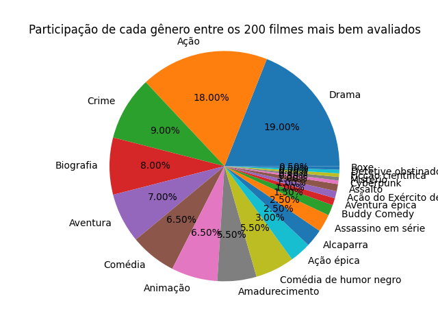

# Gráficos dos 200 melhores filmes do IMDB
Este projeto faz scrapping da lista dos 200 melhores filmes de acordo com o IMDB e extrai o ano e o gênero desses filmes, salva em uma tabela .csv e cria gráficos de:
- Quantidades de filme por gênero
- Quantidade de filmes por ano

# Tecnologias utilizadas
- Python
- Matplotlib
- Seaborn
- Pandas
- Playwright

# Gráfico de gêneros

# Gráfico de anos

